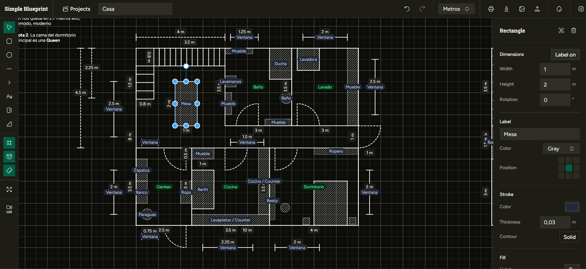

# Simple Blueprint

**Un editor de planos rápido y sin complicaciones que corre completamente en tu navegador.**

Sin cuenta. Sin suscripción. Sin servidor. Ábrelo y empieza a dibujar.

---

<!-- Captura 1: coloca aquí tu screenshot principal de la app -->


---

## ¿Por qué Simple Blueprint?

La mayoría de las herramientas de diagramación te obligan a registrarte, pagar o esperar a que cargue un servidor. Simple Blueprint se salta todo eso. Guarda cada proyecto localmente en tu navegador, auto-guarda mientras trabajas y exporta PNGs limpios que podés pegar directamente en una presentación o mandarle a un contratista.

Tiene una sola obsesión: **las dimensiones reales importan**. Cada forma en el canvas tiene un tamaño físico en metros o centímetros. Las etiquetas de dimensión se actualizan en tiempo real mientras dibujas, así siempre sabes exactamente qué tan grande es tu habitación — sin adivinar, sin hacer cuentas mentales.

---

## Funcionalidades

**Dibuja lo que necesitas**
- Rectángulos, elipses, líneas, flechas y texto enriquecido
- Formas específicas para arquitectura: puertas y escaleras
- Rellenos con tramas (hatching) para muros y secciones sólidas
- Etiquetas de colores para anotar cualquier elemento

**Precisión sin esfuerzo**
- Grilla configurable con snap — ubicá las formas exactamente donde querés
- Etiquetas de dimensión en vivo que siguen cada elemento
- Unidades reales (metros / centímetros) en todo el sistema
- Bloqueo de formas para que tus muros no se muevan de casualidad

**Un espacio de trabajo limpio**
- Tres temas: claro, oscuro y azul blueprint
- Panel de propiedades colapsable — más canvas cuando lo necesitás
- Historial completo de deshacer / rehacer
- Atajos de teclado para cada herramienta (V, R, C, L, A, T, D, S)

**Exportación sin fricción**
- Exporta a PNG con selección de recorte opcional — capturá exactamente la zona que querés a resolución 3×
- Exporta e importa proyectos como JSON para respaldos o para compartir
- Imprime directamente desde el navegador con un diseño de impresión limpio

**Soporte multi-proyecto**
- Creá y alternás entre múltiples proyectos desde el panel de Proyectos
- Todo se guarda automáticamente en localStorage — sin botón de guardar manual


## Cómo empezar

```bash
npm install
npm run dev
```

Abrí `http://localhost:5173` y empezá a dibujar.

```bash
npm run build    # build de producción
npm run preview  # previsualizar el build
```

---

## Notas técnicas

Construido con **React 19**, **TypeScript**, **Vite** y **Zustand** para el manejo de estado. Componentes de UI con **shadcn/ui** (Tailwind CSS). Exportación a PNG via **html-to-image**.

Todos los datos se almacenan en `localStorage` — no hay backend. La unidad canónica para todas las coordenadas y tamaños es el **metro**; la conversión a centímetros ocurre solo en la capa de UI.

---

## Licencia

[MIT](LICENSE)
